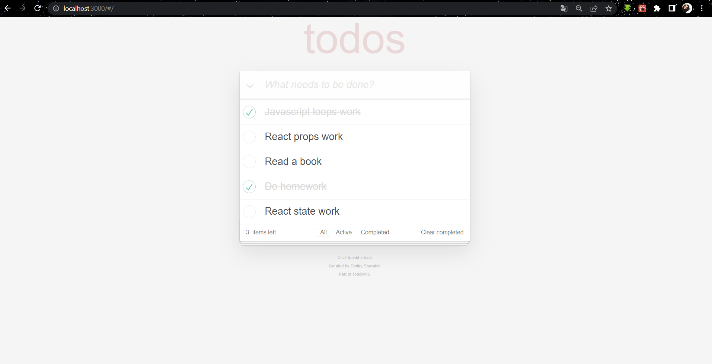

# React ile To Do List

- İlk olarak çalışacağımız dizinde “create-react-app” komutunu çalıştırıyoruz. React dosyalarını bu komut ile indirmiş oluyoruz.
- Daha sonra “npm start” ile projemizi çalıştırıyoruz.

### Uygulama Hakkında

Bu proje Components, Props, States ve Lifecycle gibi konuların pekiştirilmesi amacıyla yapılmıştır. 

To do list’e görevlerimizi ekledikten sonra : 

- Ana Ekran

Yapılan görevlere tik atılabiliyor. Bu sayede yapılmayan görevleri rahatlıkla görebiliyoruz.

- Ayrıca tüm görevleri görebileceğimiz “All” seçeneği, henüz yapılmamış görevleri görebileceğimiz “Active” seçeneği ve yapılmış görevleri görebileceğimiz bir “Completed” seçeneği bulunuyor. Bu seçeneklerden hangisi aktif ise o seçenek daha belirgin olarak ekranda görünüyor.
- Active

- Completed

- Bunun dışında istediğimiz yapılmış veya yapılmamış görevi silebileceğimiz bir çarpı butonu bulunuyor.

- Tüm görevleri yapılmış ya da yapılmamış olarak işaretleyebileceğimiz bir v butonumuz bulunuyor.

- Kalan görevlerin sayısının olduğu “… item left”

- Yapılmış-tamamlanan tüm görevleri silebileceğimiz “Clear completed”

